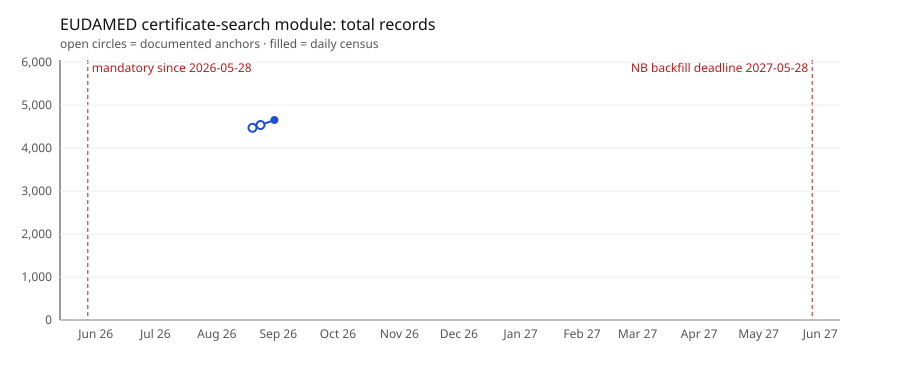

# The certificate census

How fast is EUDAMED's certificate module filling up? Since **2026-05-28**
the first EUDAMED modules are mandatory, and notified bodies may backfill
legacy certificates until **2027-05-28**. This page tracks the fill level —
one measurement per day, one dot per day.



## Method — what exactly is counted

**This is not scraping.** Every paginated response of the UI API carries
`totalElements`, the server-side count of the full result set. The census
asks the counting machine three questions a day (devices, certificates, one
reference group) plus feature flags and build version — seven requests, 2 s
apart, appended as one JSON line. The line schema is frozen; fields are only
ever added. Failed runs write an error line: outages are availability data,
not gaps.

**What the curve counts:** the **certificate-search module**
(`api/certificates/search/`), which stores MDR/IVDR certificates linked to
the manufacturer via `actorSrn`. It does **not** count "all certificates in
EUDAMED": the device-linked legacy store (`deviceCertificateInfoList` inside
Basic-UDI records, almost exclusively MDD/AIMDD, ~544 records) is a disjoint
data path with no cheap count — see
[gotcha 8](gotchas.md#8-the-two-certificate-sources-are-disjoint). The
MDR/IVDR split comes from a weekly full pull (14 pages), which is also
archived as a dated dump — that archive is what enables per-notified-body
fill rates, status transitions and upload-lag analysis (new UUIDs per week
against their `issueDate`).

**Known limitation:** the device-linked legacy path is not measured
longitudinally. A fixed monthly device panel could close that; it is noted,
not built.

Refused applications are counted weekly from `api/applications/search/`
(measured 2026-08-30 with a control probe: 290 refused vs 4,654 issued —
the endpoint, not a parameter, separates the two).

## The series

| Date | Certificates | MDR | IVDR | Refused | Source |
|---|---|---|---|---|---|
| 2026-07-30 | 4,050 | — | — | — | documented |
| 2026-08-05 | 4,055 | 3748 | 307 | — | documented |
| 2026-08-19 | 4,472 | — | — | — | documented |
| 2026-08-30 | 4,654 | — | — | — | census |

Measurement gaps longer than 3 days in the daily series:

None so far.

## Reproduce

```bash
# one census point (in the AskEUDAMED tool repo; 7 requests)
python scripts/zaehlstand.py

# re-render this page from the checked-in series
python scripts/fill_level.py
```

Raw series: [`data/census/`](../data/census/) — seed anchors with their
provenance, the daily JSONL, and dated weekly dumps of the full certificate
table.

*Last data point: 2026-08-30. Deadline dates should be re-verified against
Regulation (EU) 2024/1860 and the implementing decision before citing.*
